# Galleon Attributes ⚓

A simple yet powerful tool for Webflow Pirates to create dynamic content using data attributes.

🚧 Galleon Attributes is currently in beta. 🚧

## Ahoy there! Welcome aboard! 🏴‍☠️

Galleon Attributes helps you create dynamic, data-driven websites without sailing into the treacherous waters of complex code. Made for Webflow, but works with any tool that supports data attributes.

## The Treasure This Tool Provides 💎

- **Data Binding**: Easily connect your HTML elements to data sources
- **Webflow-Friendly**: Designed specifically for Webflow projects
- **No Heavy Coding Required**: Perfect for the low-code/no-code sailors
- **Lightweight**: Won't slow down your ship (website)

## Set Sail ⛵ (Quick Start)

### Add the Galleon Script

Add the following to your Webflow project's `Site Settings > Custom Code > Head Code`:

```html
<script
  async
  src="https://cdn.jsdelivr.net/npm/@raae/galleon-attributes@v1/dist/script.js"
></script>
```
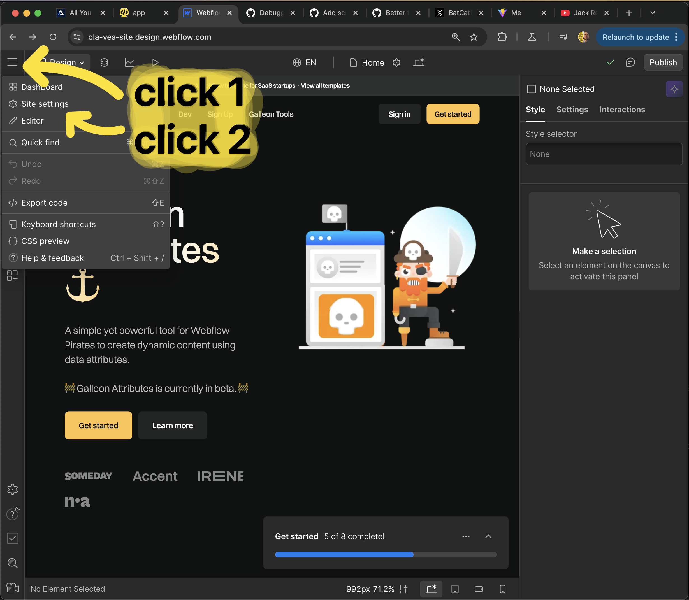

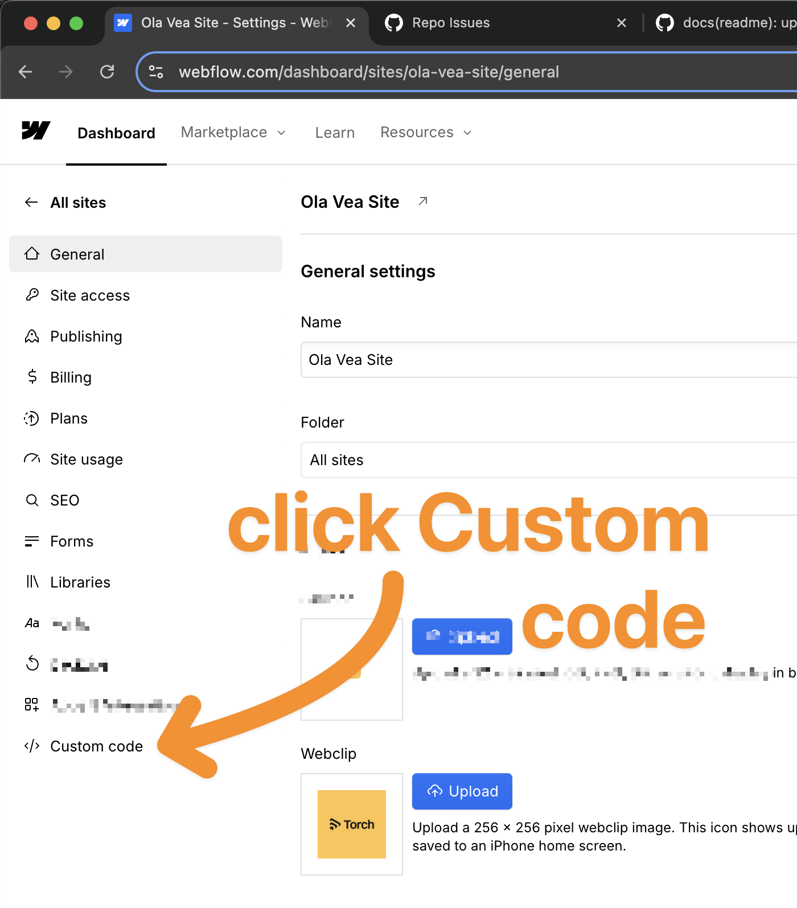

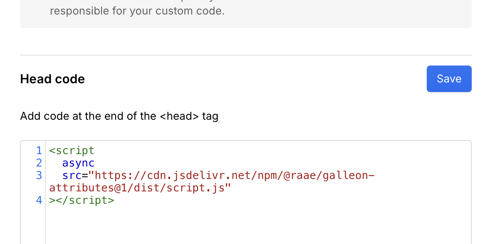

### Test Galleon Attributes

Start by using our test APIs to get the hang of it.

1. Select a container element to hold the data

   ➕ Add attribute `gl-get` with value `https://cdn.jsdelivr.net/npm/@raae/galleon-attributes@v1/dist/queen.json`.\
   💡 It will fetch the data from the url and make it available to the element and its childrens.
   
   
   
   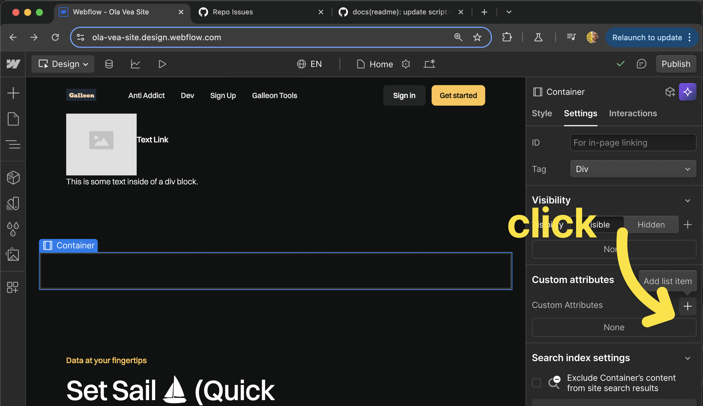

   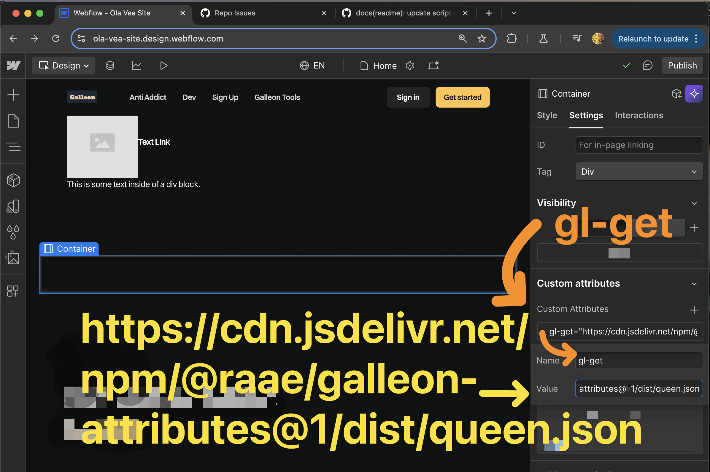

2. Select a _multiline text_ child of the container element

   ➕ Add attribute `gl-bind` with value `bio`.\
   💡 It will bind the text content of the element to the `bio` property of the data.
   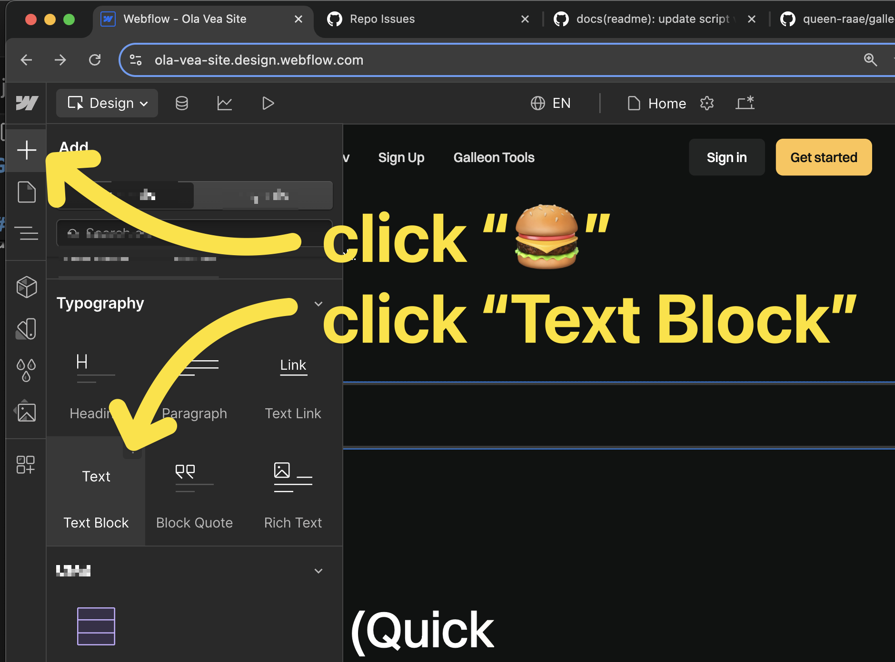
   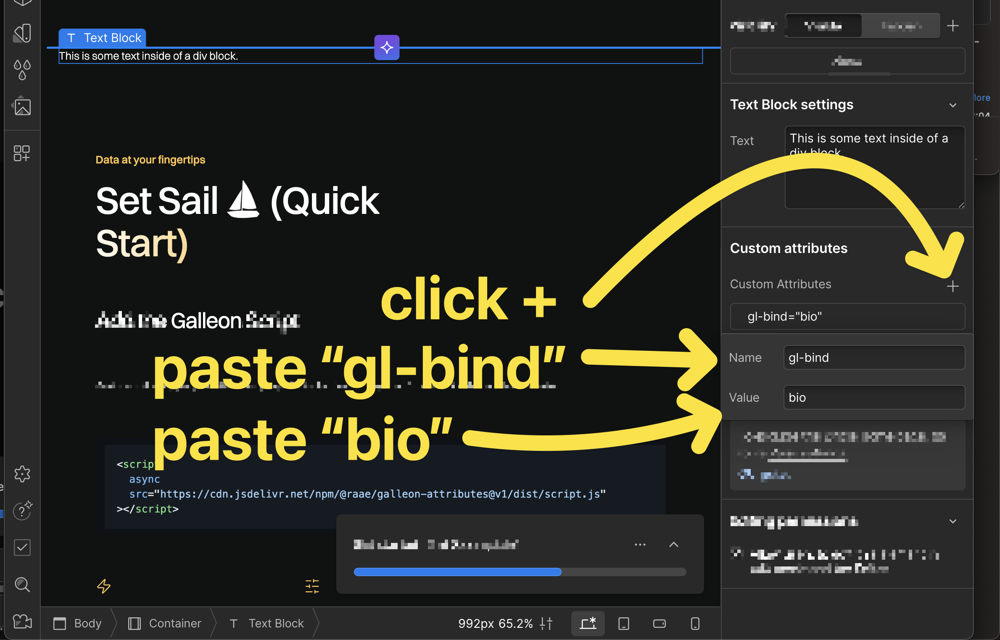

3. Select an _image_ child of the container element

   ➕ Add attribute `gl-bind-src` with value `avatar.url`.\
   💡 It will bind the `src` attribute of the element to the `avatar.url` property of the data.

   ➕ Add attribute `gl-bind-alt` with value `avatar.alt`.\
   💡 It will bind the `alt` attribute of the element to the `avatar.alt` property of the data.
   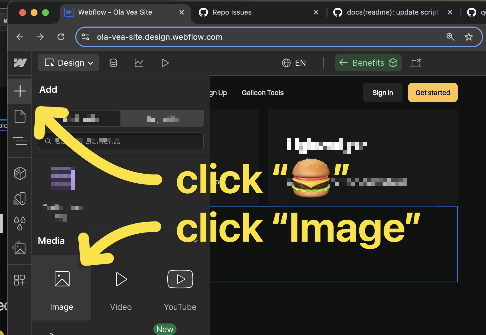
   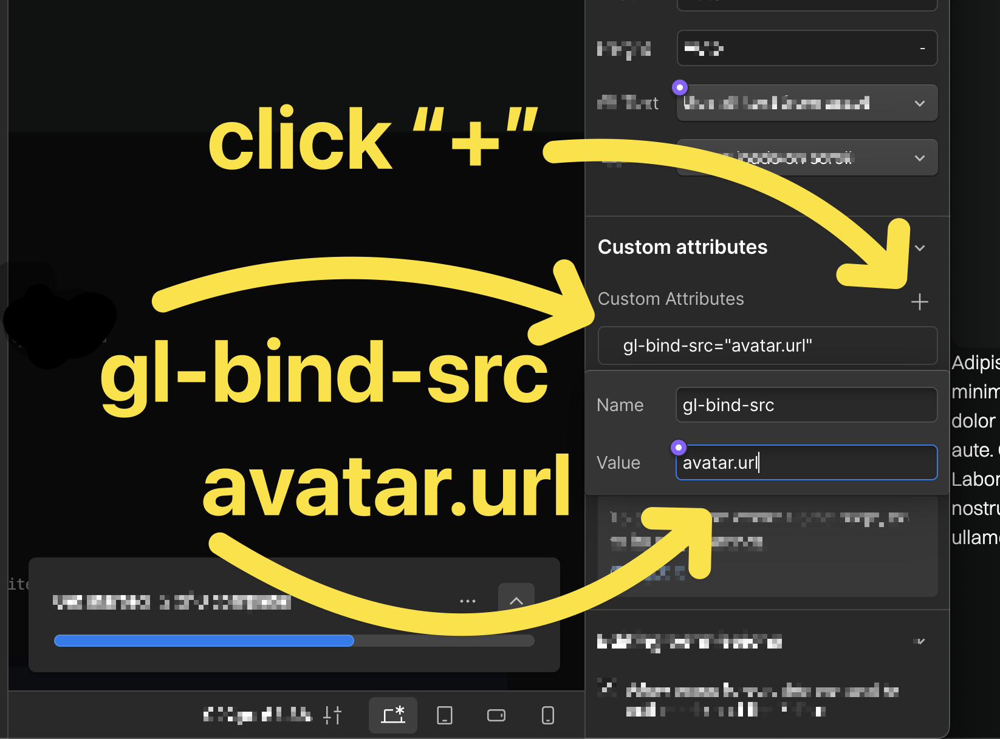
   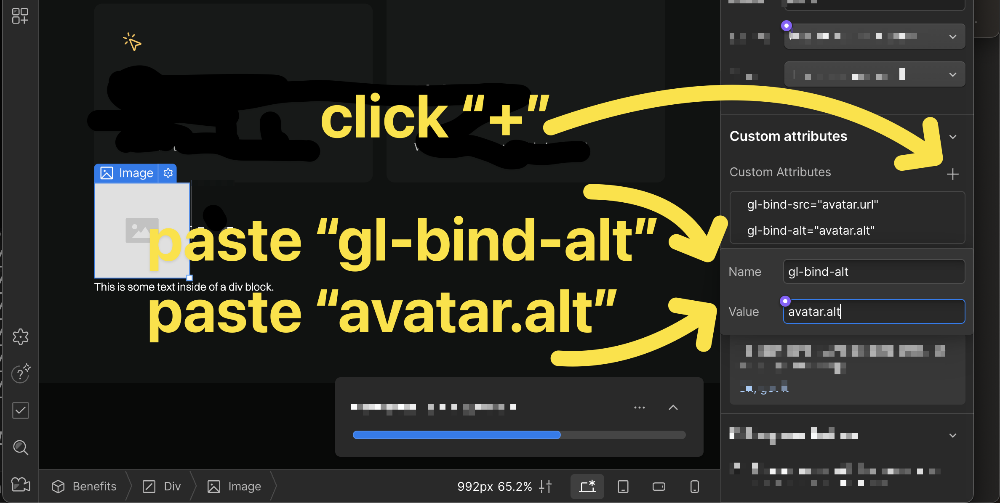

4. Select a _link_ child of the container element

   ➕ Add attribute `gl-iterate` with value `socials`.\
   💡 It will iterate over the `socials` property of the data and create a copy of the element for each item.

   ➕ Add attribute `gl-bind-href` with value `url`.\
   💡 It will bind the `href` attribute of the element to the `url` property of the `socials` item data.

   ➕ Add attribute `gl-bind` with value `label`.\
   💡 It will bind set the inner html content (text) of the element to the `label` property of the `socials` item data.
   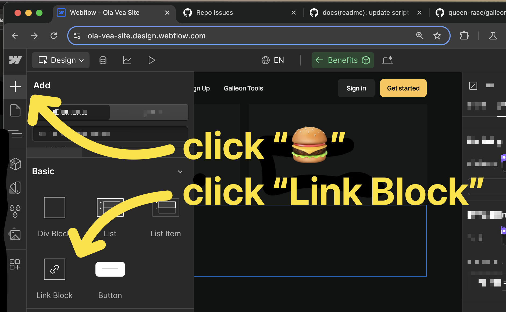
   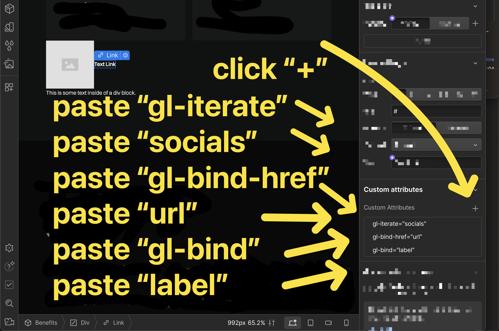
   
## Treasure Map (User Guide)

Coming...

### The Attributes

| Attribute        | Purpose                                         | Example                          |
| ---------------- | ----------------------------------------------- | -------------------------------- |
| `gl-get`         | Fetches JSON data from an endpoint              | `<div gl-get="/api/data.json">`  |
| `gl-bind`        | Binds element's text content to a data property | `<h1 gl-bind="title">Title</h1>` |
| `gl-bind-[attr]` | Binds specific attributes to data properties    | ``  |
| `gl-iterate`     | Iterates through array items                    | `<li gl-iterate="items">`        |

### The Values

- **Properties**: Access properties with dot notation, such as `user.profile.name`
- **Array Indexing**: Access specific items with `property[index]` syntax, such as `socials[0].url`

## The Galleon Tools

Galleon Attributes will be a part a larger Galleon fleet, aiming to unlock user data for Webflow Pirates:

- Galleon Gateway: Fetch personalized content from tools like Airtable, Notion, Google Sheets, etc.
- Galleon ???: Pitch your user data needs!

## Join the Voyage

- 📰 [Subscribe to our Galleon newsletter](https://galleon.tools)

## Captain's Log (License)

MIT © [Queen Raae](https://github.com/queen-raae)

