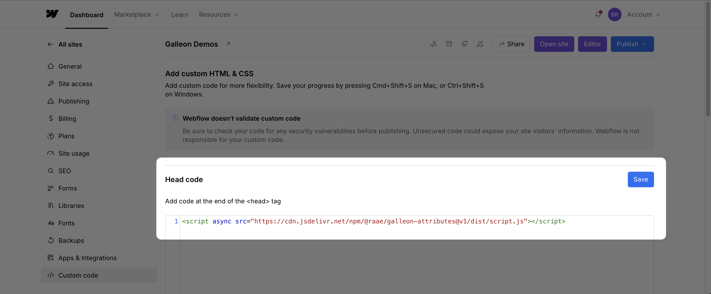
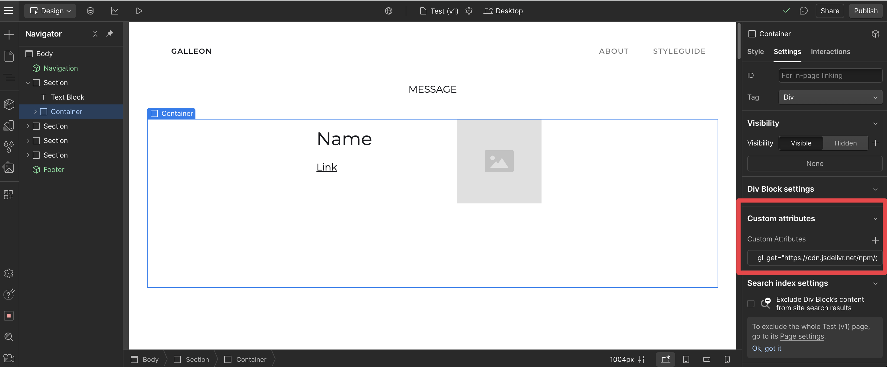
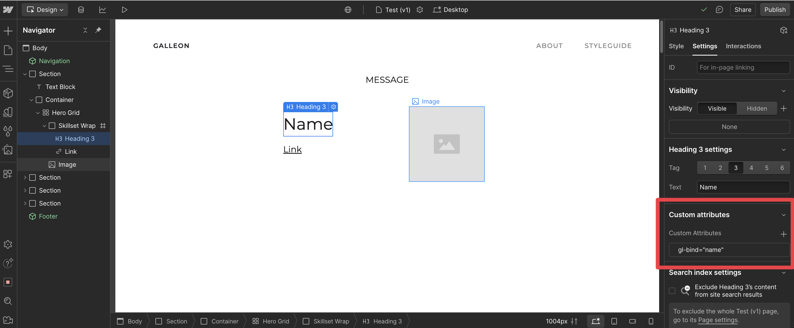
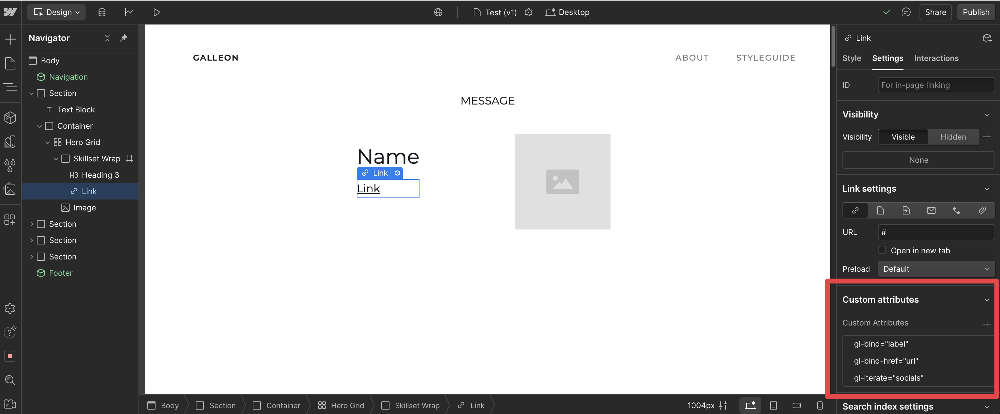
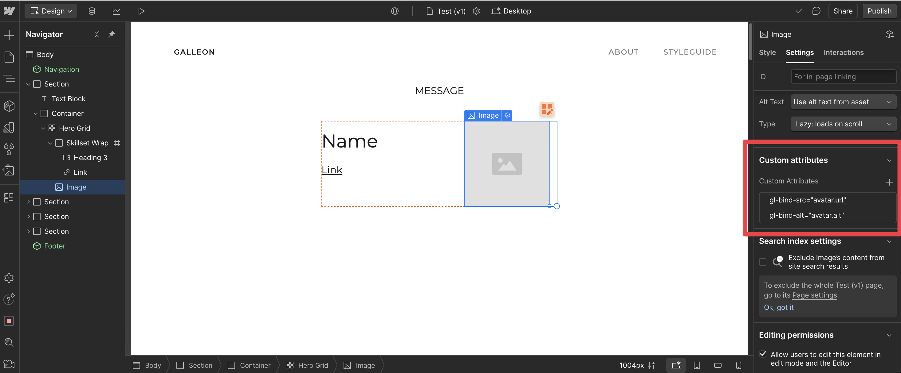
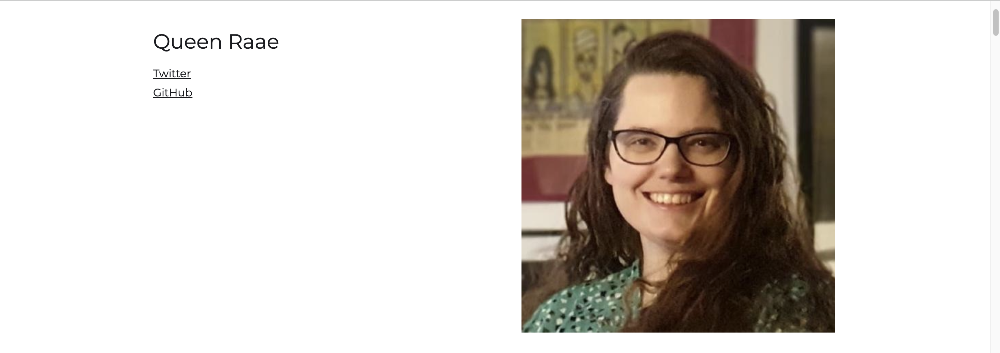
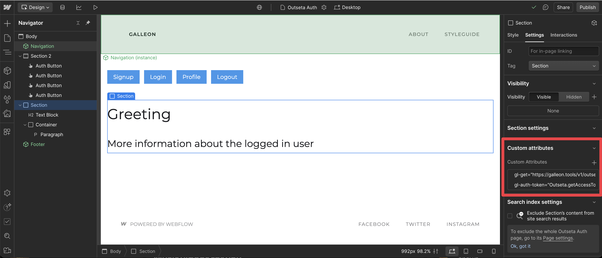
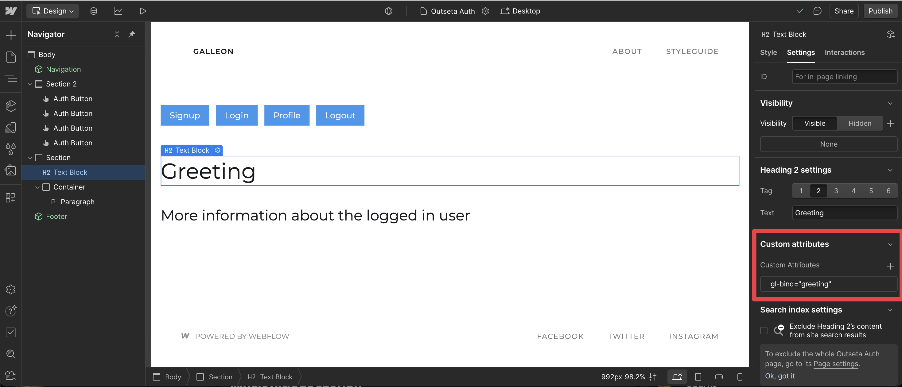
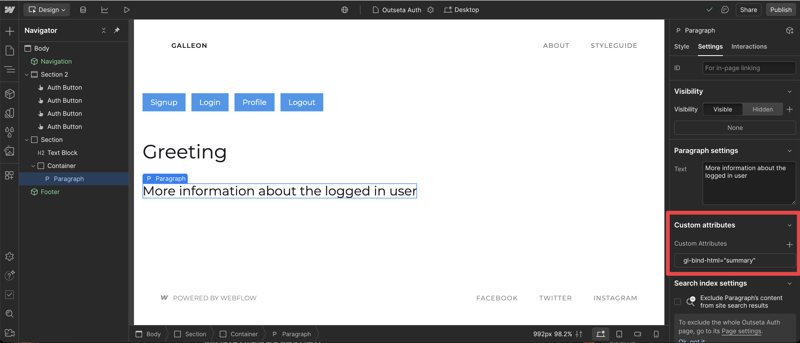
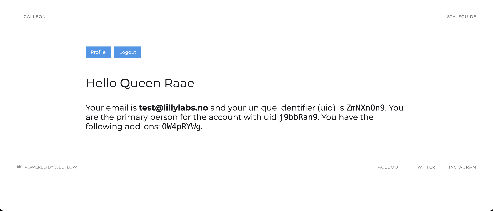

# Galleon Attributes ⚓

A simple yet powerful tool for Webflow Pirates to create dynamic content using data attributes.

🚧 Galleon Attributes is currently in beta. 🚧

## Ahoy there! Welcome aboard! 🏴‍☠️

Galleon Attributes helps you create dynamic, data-driven websites without sailing into the treacherous waters of complex code. Made for Webflow, but works with any tool that supports data attributes.

## The Treasure This Tool Provides 💎

- **Data Binding**: Easily connect your HTML elements to data sources
- **Webflow-Friendly**: Designed specifically for Webflow projects
- **No Heavy Coding Required**: Perfect for the low-code/no-code sailors
- **Lightweight**: Won't slow down your ship (website)

## Set Sail ⛵ (Quick Start)

### Add the Galleon Script

Add the following to your Webflow project's `Site Settings > Custom Code > Head Code`:

```html
<script
  async
  src="https://cdn.jsdelivr.net/npm/@raae/galleon-attributes@1/dist/script.js"
></script>
```



### Test Galleon Attributes

Start by using our test APIs to get the hang of it.

💡 [Tip] If you use Outseta, jump to the [Test Galleon Attributes with Outseta](#test-galleon-attributes-with-outseta) section.

#### Test API: Queen Raae Info 👑

1. Select a container element to hold the data

   ➕ Add attribute `gl-get` with value `https://galleon.tools/v1/queen`.\
   ✨ It will fetch the data from the url and make it available to the element and its children.

   

2. Select a _multiline text_ child of the container element

   ➕ Add attribute `gl-bind` with value `name`.\
   ✨ It will bind the text content of the element to the `bio` property of the response.

   

3. Select an _image_ child of the container element

   ➕ Add attribute `gl-bind-src` with value `avatar.url`.\
   ✨ It will bind the `src` attribute of the element to the `avatar.url` property of the response.

   ➕ Add attribute `gl-bind-alt` with value `avatar.alt`.\
   ✨ It will bind the `alt` attribute of the element to the `avatar.alt` property of the response.

   

4. Select a _link_ child of the container element

   ➕ Add attribute `gl-iterate` with value `socials`.\
   ✨ It will iterate over the `socials` property of the response and create a copy of the element for each item.

   ➕ Add attribute `gl-bind-href` with value `url`.\
   ✨ It will bind the `href` attribute of the element to the `url` property of the `socials` item response.

   ➕ Add attribute `gl-bind` with value `label`.\
   ✨ It will bind set the text content of the element to the `label` property of the `socials` item response.

   

5. Publish your changes and see the magic happen!

   

### Test Galleon Attributes with Outseta

#### Prerequisites

- An Outseta account
- The Outseta script and configuration added to the head of your site
- Login functionality added to your site using Outseta embeds
- The Galleon script added to the [head of your site](#add-the-galleon-script)

#### Test API: Outseta User Info 🔑

1. Select a container element to hold the data

   ➕ Add attribute `gl-get` with value `https://galleon.tools/v1/outseta/me`.\
   ➕ Add attribute `gl-auth-token` with value `Outseta.getAccessToken(), query:access_token`.\
   ✨ It will fetch the data from the url and make it available to the element and its children.

   💡 The test API endpoint `galleon.tools/v1/outseta/me` verifies the access token and creates a personalized greeting and summary of the user's data.

   

2. Select a _text_ child of the container element

   ➕ Add attribute `gl-bind` with value `greeting`.\
   ✨ It will bind the text content of the element to the personalized `greeting` property of the response.

   

3. Select a _multiline text_ child of the container element

   ➕ Add attribute `gl-bind-html` with value `summary`.\
   ✨ It will bind the html content of the element to the personalized `summary` property of the response.

   

4. Publish your changes and see the magic happen!

   

💡 [Tip] Not the most exciting user info, but you can use this approach to fetch data from any API that expects the Outseta access token, such as a custom API from your backend devs. Or use a similar approach to fetch data from any other API that requires authentication, see the [Authorization](#authorization) section for more details.

## Treasure Map (User Guide)

Coming...

### The Attributes

| Attribute        | Purpose                                               | Example                                 |
| ---------------- | ----------------------------------------------------- | --------------------------------------- |
| `gl-get`         | Fetches JSON data from an endpoint                    | `<div gl-get="/api/data.json">`         |
| `gl-bind`        | Binds element's text content to a data property       | `<h1 gl-bind="title">Title</h1>`        |
| `gl-bind-[attr]` | Binds specific attributes to data properties          | ``         |
| `gl-bind-html`   | Binds element's inner html content to a data property | `<div gl-bind-html="content">`          |
| `gl-iterate`     | Iterates through array items                          | `<li gl-iterate="items">`               |
| `gl-auth-token`  | Authentication source and key                         | `<div gl-auth-token="local:userToken">` |

#### `gl-bind`, `gl-bind-[attr]` and `gl-iterate`

- **Properties**: Access properties with dot notation, such as `user.profile.name`
- **Array Indexing**: Access specific items with `property[index]` syntax, such as `socials[0].url`

### Authorization

You can authenticate API requests using the `gl-auth-token` attribute:

```html
<div
  gl-get="https://example.com/api-with-auth/data"
  gl-auth-token="local:userToken"
></div>
```

The format is `source:key` where:

- `source` can be `local` (localStorage), `session` (sessionStorage), `query` (URL query parameter), or omitted for global scope
- `key` is the name of your token variable or function

Examples:

- `gl-auth-token="local:userToken"` - Get token from localStorage with key "userToken"
- `gl-auth-token="session:apiKey"` - Get token from sessionStorage with key "apiKey"
- `gl-auth-token="query:token"` - Get token from URL query parameter with key "token"
- `gl-auth-token="authToken"` - Use a global variable named "authToken"
- `gl-auth-token="Outseta.getAccessToken()"` - Use a global function named "getAccessToken" from the "Outseta" SDK

> **Important**: When `gl-auth-token` is specified but no valid value is found, the request will be skipped. This helps prevent failed API requests to protected endpoints.

#### Multiple Auth Token Sources

You can specify multiple auth token sources in a single `gl-auth-token` attribute using comma-separated values. The system will try each source in order and use the first one that has a valid value:

```html
<div
  gl-get="https://example.com/api-with-auth/data"
  gl-auth-token="query:token, local:authToken, session:apiKey, ThirdParty.getToken()"
></div>
```

This will first check for a URL query parameter named "token", then a value in localStorage under the key "authToken",
then a value in sessionStorage under the key "apiKey", and finally a value from a global function named "getToken" from the "ThirdParty" SDK. The first source to return a truthy value will be used.

#### Global Scope

```javascript
// Auth value in global scope
window.myAuthToken = "a-unique-token";

<div
  gl-get="https://example.com/api-with-auth/data"
  gl-auth-token="myAuthToken"
></div>;
```

```javascript
// Auth function in global scope
window.getMyToken = function () {
  return "your-custom-token";
};

<div
  gl-get="https://example.com/api-with-auth/data"
  gl-auth-token="getMyToken()"
></div>;
```

For global scope, you can also use nested paths to access properties and methods on objects (or more usually SDKs).

```javascript
// Nested object with a token property in global scope
window.Auth = {
  token: "your-custom-token",
};

<div
  gl-get="https://example.com/api-with-auth/data"
  gl-auth-token="Auth.token"
></div>;
```

```javascript
// Nested object with auth method in global scope
window.Auth = {
  getToken: function () {
    return "your-custom-token";
  },
};

<div
  gl-get="https://example.com/api-with-auth/data"
  gl-auth-token="Auth.getToken()"
></div>;
```

```javascript
// With Outseta script and configuration already in place

<div
  gl-get="https://example.com/api-with-auth/data"
  gl-auth-token="Outseta.getAccessToken()"
></div>
```

## The Galleon Tools

Galleon Attributes will be a part a larger Galleon fleet, aiming to unlock user data for Webflow Pirates:

- Galleon Gateway: Fetch personalized content from tools like Airtable, Notion, Google Sheets, etc.
- Galleon ???: Pitch your user data needs!

## Join the Voyage

- 📰 [Subscribe to our Galleon newsletter](https://galleon.tools)

## Captain's Log (License)

MIT © [Queen Raae](https://github.com/queen-raae)
